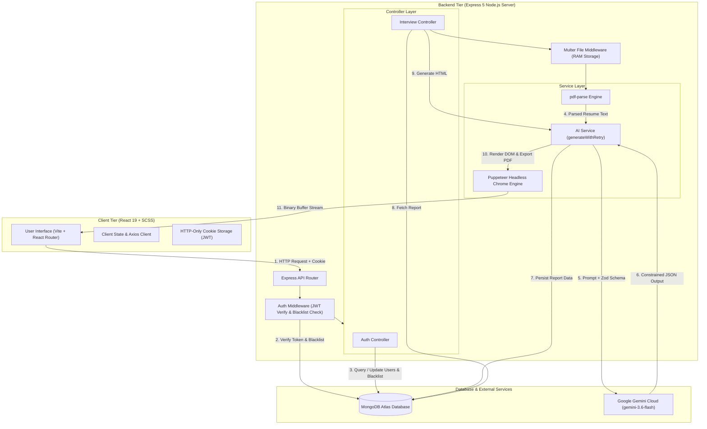

# ⚡ Prepify — AI-Powered Technical Interview & Resume Tailoring Engine

> **Prepify** is an enterprise-grade AI platform that generates personalized technical and behavioral interview preparation reports, identifies candidate skill gaps, devises day-wise preparation strategies, and compiles customized, ATS-optimized vector A4 PDF resumes using Google Gemini AI and headless Puppeteer Chrome rendering.

---

## 🌟 Key Features

* 📄 **Automated Resume Parsing (`pdf-parse`):** In-memory text extraction from uploaded binary PDF resumes without persistent server-side disk storage.
* 🤖 **AI-Driven Interview Intelligence:** Tailored technical & behavioral question generation, interviewer intentions, sample answers, match scores, and skill gap severities powered by `gemini-3.6-flash`.
* 📑 **ATS-Optimized PDF Resume Generator:** Server-side HTML/CSS rewriting by Gemini AI, rendered into vector A4 PDF binary streams using headless Puppeteer Chrome.
* 🔒 **Production-Grade Auth & Security:** HTTP-Only JWT authentication cookies, bcrypt password hashing, and a MongoDB TTL-indexed `blacklisttokens` collection for immediate logout token revocation.
* ⚙️ **Resilient AI Pipeline (`generateWithRetry`):** Custom exponential backoff engine handling transient `503 Service Unavailable` capacity limits and `429 Rate Limit` errors automatically.
* 🎯 **100% Deterministic AI Responses:** Zod schema validation converted via `zodToJsonSchema` activating Gemini's constrained decoding layer to guarantee strictly typed JSON outputs.

---

## 🛠️ Technology Stack

| Layer | Technology / Library | Purpose |
| :--- | :--- | :--- |
| **Frontend** | React 19, Vite, SCSS, Axios | Fast, modern single-page application with responsive UI styling |
| **Backend** | Node.js, Express 5 | RESTful API backend handling routing, file uploads, and service orchestration |
| **Database** | MongoDB Atlas, Mongoose ODM | Cloud NoSQL persistence for user profiles, blacklisted JWT tokens, and interview reports |
| **AI Cloud** | `@google/genai` (`gemini-3.6-flash`) | Ultra-low latency multimodal LLM for intelligent evaluation and resume rewriting |
| **Schema Validation** | Zod, `zodToJsonSchema` | Enforces 100% strict JSON schema structures from Google Gemini |
| **PDF Engine** | Puppeteer (Headless Chromium) | Renders AI-generated HTML/CSS into downloadable vector A4 binary PDFs |
| **File Parsing** | `pdf-parse`, Multer (`memoryStorage`) | Extracts plain text from binary PDF uploads directly in RAM memory |

---

## 🏗️ System Architecture & Workflow



---

## 📁 Repository Structure

```
interview-ai-yt/
├── Backend/
│   ├── src/
│   │   ├── config/
│   │   │   └── db.js                  # MongoDB Atlas Mongoose connection
│   │   ├── controllers/
│   │   │   ├── auth.controller.js     # User registration, login, logout, password change
│   │   │   └── interview.controller.js# Interview report generation, fetching, & PDF streaming
│   │   ├── middlewares/
│   │   │   ├── auth.middleware.js     # JWT cookie validation & blacklist check
│   │   │   └── file.middleware.js     # Multer RAM memory storage middleware
│   │   ├── models/
│   │   │   ├── user.model.js          # User user schema (bcrypt hashed passwords)
│   │   │   ├── blacklistToken.model.js# Token blacklist schema with TTL auto-expiration
│   │   │   └── interviewReport.model.js# Interview report schema (Questions, Scores, Gaps)
│   │   ├── routes/
│   │   │   ├── auth.routes.js         # Authentication routes (/api/auth)
│   │   │   └── interview.routes.js    # Interview & PDF routes (/api/interview)
│   │   ├── services/
│   │   │   └── ai.service.js          # Gemini integration, Zod schemas, Retry engine, Puppeteer PDF
│   │   └── app.js                     # Express app setup, CORS, CookieParser, global error handling
│   ├── .env                           # Environment configuration
│   └── package.json
├── Frontend/
│   ├── src/
│   │   ├── components/                # Reusable UI components (Navbar, Loading Screen)
│   │   ├── pages/                     # Application pages (Home, Login, Register, Report, History)
│   │   ├── services/                  # Axios HTTP client configuration
│   │   ├── style/                     # Global SCSS stylesheets and design system
│   │   ├── App.jsx                    # React Router configuration
│   │   └── main.jsx
│   └── package.json
└── README.md
```

---

## ⚡ Getting Started & Local Setup

### Prerequisites
* **Node.js** (v18.0.0 or higher)
* **MongoDB Atlas** database connection URI
* **Google Gemini API Key** (from Google AI Studio)

---

### 1. Backend Setup

1. Navigate to the `Backend` directory:
   ```bash
   cd Backend
   ```

2. Install dependencies:
   ```bash
   npm install
   ```

3. Create a `.env` file in the `Backend` folder:
   ```env
   PORT=3000
   MONGO_URI=mongodb+srv://<username>:<password>@cluster.mongodb.net/prepify?retryWrites=true&w=majority
   JWT_SECRET=your_jwt_secret_key_here
   GOOGLE_GENAI_API_KEY=your_google_gemini_api_key_here
   ```

4. Start the backend development server:
   ```bash
   npm run dev
   ```
   The backend server will start on `http://localhost:3000`.

---

### 2. Frontend Setup

1. Navigate to the `Frontend` directory:
   ```bash
   cd ../Frontend
   ```

2. Install dependencies:
   ```bash
   npm install
   ```

3. Start the frontend development server:
   ```bash
   npm run dev
   ```
   The frontend application will be running on `http://localhost:5173`.

---

## 📡 API Reference Documentation

### Authentication Routes (`/api/auth`)

| Method | Endpoint | Access | Description |
| :--- | :--- | :--- | :--- |
| `POST` | `/api/auth/register` | Public | Registers a new user account with hashed password |
| `POST` | `/api/auth/login` | Public | Authenticates user & sets HTTP-Only JWT cookie |
| `GET` | `/api/auth/logout` | Public | Clears cookie & adds token to MongoDB blacklist |
| `GET` | `/api/auth/get-me` | Private | Returns current logged-in user profile |
| `PUT` | `/api/auth/change-password` | Private | Updates password for authenticated user |

### Interview & Report Routes (`/api/interview`)

| Method | Endpoint | Access | Description |
| :--- | :--- | :--- | :--- |
| `POST` | `/api/interview/generate` | Private | Uploads resume PDF, extracts text, generates report |
| `GET` | `/api/interview/report/:interviewId` | Private | Fetches specific interview report by ID |
| `GET` | `/api/interview/reports` | Private | Fetches all interview reports for logged-in user |
| `GET` | `/api/interview/resume-pdf/:interviewId` | Private | Compiles & streams ATS-optimized A4 PDF resume download |

---

## 🧠 Core Engineering Highlights

### 1. Exponential Backoff Retry Engine (`generateWithRetry`)
To handle transient Google Cloud capacity spikes (`HTTP 503` / `HTTP 429`), all Gemini API calls pass through an exponential retry loop with increasing delay:
```javascript
async function generateWithRetry(params, retries = 3, delayMs = 1500) {
    for (let i = 0; i < retries; i++) {
        try {
            return await ai.models.generateContent(params);
        } catch (error) {
            const isTransient = error.status === 503 || error.status === 429 || error.message?.includes("503");
            if (isTransient && i < retries - 1) {
                await new Promise(res => setTimeout(res, delayMs * (i + 1)));
            } else throw error;
        }
    }
}
```

### 2. In-Memory Privacy Model
Uploaded resume `.pdf` files are stored strictly in RAM (`multer.memoryStorage()`) during request execution. Parsed text is persisted securely in MongoDB Atlas, ensuring zero temporary files accumulate on server storage.

---

## 📜 License

Distributed under the MIT License. See `LICENSE` for more information.
